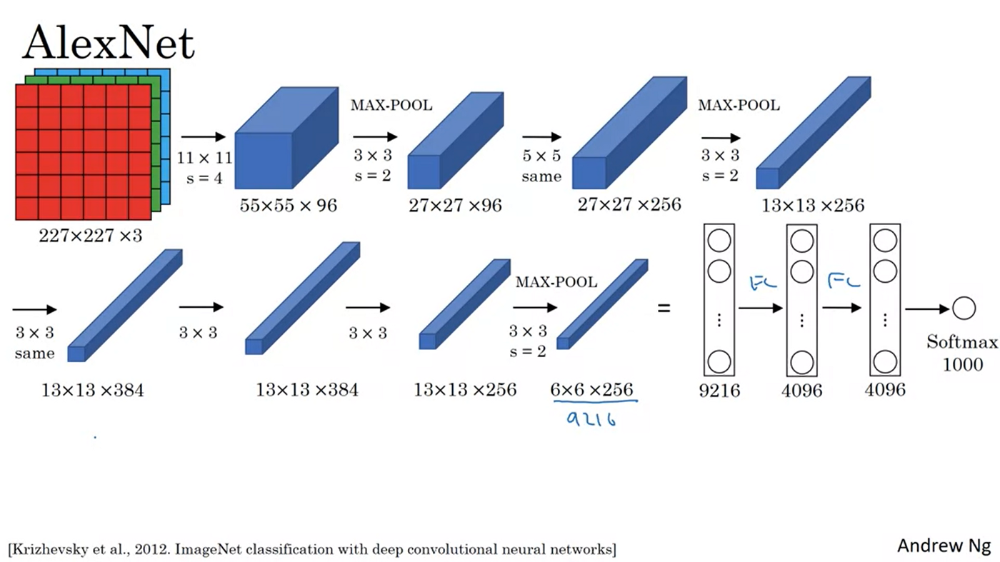
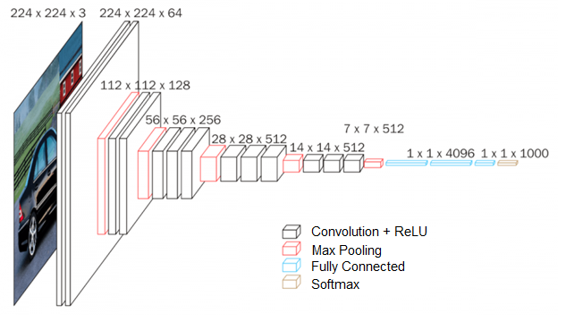

# CNNs: Image Classification, Object Detection & Face Recognition.

## How to Use Filter Size, Padding, and Stride:

## How milestone model architectural innovations work:
* LeNet-5
* AlexNet (Winner of 2012 ImageNet competition) When we talk about the Pre-trained model in the Computer Vision domain, Alexnet comes out as a leading architecture. The Alexnet has eight layers with learnable parameters. The model consists of five layers with a combination of max pooling followed by 3 fully connected layers and they use Relu activation in each of these layers except the output layer. They found out that using the relu as an activation function accelerated the speed of the training process by almost six times. They also used the dropout layers, that prevented their model from overfitting. Further, the model is trained on the Imagenet dataset. The Imagenet dataset has almost 14 million images across a thousand classes.

Let’s see the architectural details in this article.
* 
* VGG-16 
* 
* Inception and GoogLeNet
* Residual Network or ResNet

## How to use 1x1 Convolutions to manage model complexity

## How to implement model architecture innovations:

# Face Recognition:
